<!-- ═══════════════════════════════════════════════════════════ -->
<!--                    ANIMATED HERO BANNER                    -->
<!-- ═══════════════════════════════════════════════════════════ -->

 

<!-- Dynamic badges -->

&nbsp;

&nbsp;

  

<!-- ═══════════════════════════════════════════════════════════ -->
<!--                      01 // ABOUT                           -->
<!-- ═══════════════════════════════════════════════════════════ -->

 

 

  

<!-- ═══════════════════════════════════════════════════════════ -->
<!--                      02 // STACK                           -->
<!-- ═══════════════════════════════════════════════════════════ -->

 

  

<!-- ═══════════════════════════════════════════════════════════ -->
<!--                    03 // PROJECTS                          -->
<!-- ═══════════════════════════════════════════════════════════ -->

 

 

  

<!-- ═══════════════════════════════════════════════════════════ -->
<!--                    04 // ACTIVITY                          -->
<!-- ═══════════════════════════════════════════════════════════ -->

 

 

  

<!-- ═══════════════════════════════════════════════════════════ -->
<!--                        FOOTER                              -->
<!-- ═══════════════════════════════════════════════════════════ -->

  
  &nbsp;
  
  &nbsp;
  
  &nbsp;
  
  &nbsp;
  

